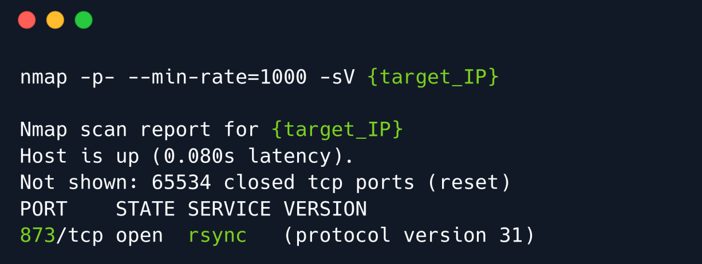

# Synced Write-up

Prepared by: amra

## Introduction

The best known file transfer service is the File Transfer Protocol (FTP), which was covered thoroughly in the Fawn machine. The main concern with FTP is that it is a very old and slow protocol. FTP is a protocol used for copying entire files over the network from a remote server. In many cases there is a need to transfer only some changes made to a few files and not to transfer every file every single time. For these scenarios, the rsync protocol is generally preferred.

The changes that need to get transfered are called **deltas**. Using deltas to update files is an extremely efficient way to reduce the required bandwidth for the transfer as well as the required time for the transfer to complete.

The official definition of rsync according to the Linux manual page is:

```
Rsync is a fast and extraordinarily versatile file copying tool. It can copy locally, to/from another host over any remote shell, or to/from a remote rsync daemon. It offers a large number of options that control every aspect of its behavior and permit very flexible specification of the set of files to be copied. It is famous for its delta transfer algorithm, which reduces the amount of data sent over the network by sending
only the differences between the source files and the existing files in the destination. Rsync is widely used for backups and mirroring and as an improved copy command for everyday use.
```

It follows directly from the definition of rsync that it's a great tool for creating/maintaining backups and keeping remote machines in sync with each other. Both of these functionalities are commonly implemented in corporate environment. In these environments time is of of the most importance, so rsync is preferred due to the speedup it offers for these tasks.

The main stages of an rsync transfer are the following:

1. rsync establishes a connection to the remote host and spawns another rsync receiver process.
2. The sender and receiver processes compare what files have changed.
3. What has changed gets updated on the remote host.

It often happens that rsync is misconfigured to permit anonymous login, which can be exploited by an attacker to get access to sensitive information stored on the remote machine. Synced is a Linux box that exposes a directory over rsync with anonymous login. We are able to remotely access this directory using the command line tool rsync and retrieve the flag.

## Enumeration

We will begin by scanning the remote host for any open ports and running services with a Nmap scan. We will be using the following flags for the scan:

```shell
-p- : This flag scans for all TCP ports ranging from 0-
-sV : Attempts to determine the version of the service running on a port
--min-rate : This is used to specify the minimum number of packets that Nmap should
send per second; it speeds up the scan as the number goes higher
```

```shell
nmap -p- --min-rate= 1000 -sV {target_IP}
```



The scan shows that only port 873 is open. Moreover, Nmap informs us that the service running on this port is rsync.

## What is rsync?

As we have already mentioned rsync is an open source utility that provides fast incremental file transfer. The way rsync works makes it an excellent choice when there is a need to synchronize files between a computer and a storage drive and across networked computers. Because of the flexibility and speed it offers, it has become a standard Linux utility, included in all popular Linux distribution by default. More information about rsync can be found at the [Wikipedia](https://en.wikipedia.org/wiki/Rsync) page.

## Connecting to rsync

Since rsync is already pre-installed on almost all Linux distributions, we can start interacting with the remote machine.

The generic syntax used by rsync is the following:

```
rsync [OPTION] ... [USER@]HOST::SRC [DEST]
```

where SRC is the file or directory (or a list of multiple files and directories) to copy from, DEST is the file or
directory to copy to, and square brackets indicate optional parameters. 

The [OPTION] portion of the syntax, refers to the available options in rsync. The list with all valid options is available over at the official manual [page](https://linux.die.net/man/1/rsync) of rsync under the section Options Summary. 

The [USER@] optional parameter is used when we want to access the the remote machine in an authenticated way. In this case, we don't have any valid credentials at our disposal so we will omit this portion and try an anonymous authentication. 

As our first attempt we will try to simply list all the available directories to an anonymous user. Reading through the manual page we can spot the option --list-only, which according to the definition is used to

"list the files instead of copying them".

At this point, we have crafted our first command that we will use to interact with the remote machine. 

```
 1rsync --list-only {target_IP}::
```


Looking at the output, we can see that we can access a directory called public with the description `Anonymous Share`. It is a common practice to call shared directories just shares. Let's go a step further and list the files inside the public share.

```
rsync --list-only {target_IP}::public
```


We notice a file called flag.txt inside the public share. Our last step is to copy/sync this file to our local machine. To do that, we simply follow the general syntax by specifying the SRC as public/flag.txt and the DEST as flag.txt to transfer the file to our local machine.

```
rsync {target_IP}::public/flag.txt flag.txt
```

Executing this command returns no output. But, on our local directory we have a new file called flag.txt.

Let's read its contents.

```
cat flag.txt
```

Congratulations! You have successfully retrieved the flag file from the remote machine using the rsync

protocol.

