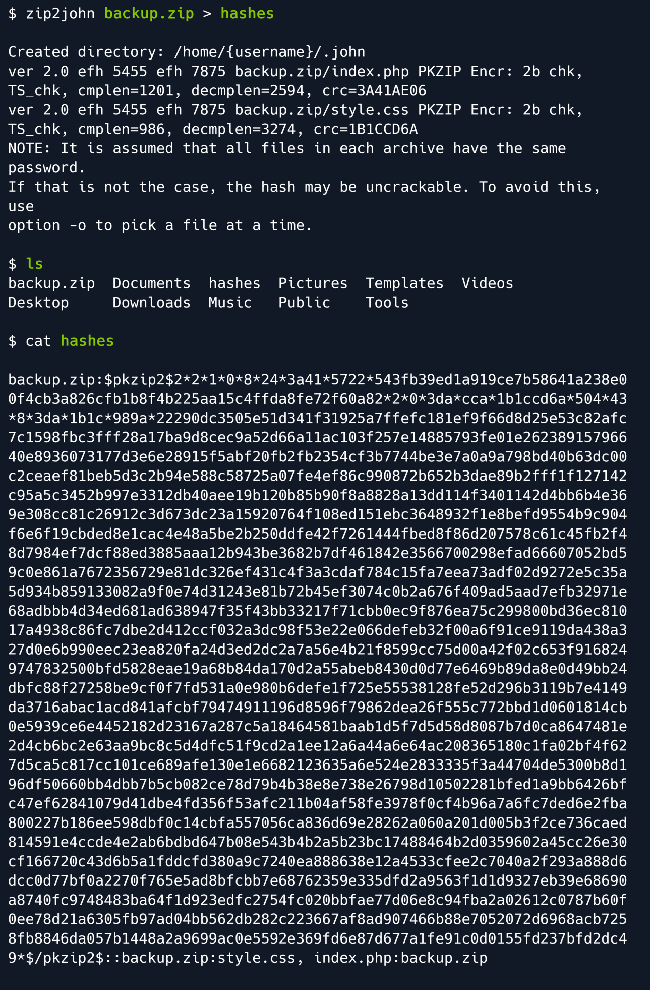

# Vaccine




**这一关sqlmap获取shell有问题，建议直接作弊ssh直连。**

### 前言

渗透测试并不是一件简单的事情，其需要很多技术知识以及跳出思维定势的能力。

简单渗透测试：系统含有一个严重的漏洞，通过公开的exp可直接攻破

普通渗透测试：系统含有各种小漏洞以及各种错误配置，通过链接这些漏洞和错误配置可攻破系统。

困难些的渗透测试：系统看起来并没有漏洞，但我们有可能通过弱口令登入系统。弱口令又可能涉及到密码爆破，要知道的一件事情是很多人其实并没有设置一个很强壮的密码，这就给予了我们可乘之机。

其实很多系统只是看起来没有漏洞，并不代表真的没有。为了有更大的可能发现隐藏起来的漏洞，那么我们就要做好信息收集，这是一个很关键的点！话不多说，正式开始我们的渗透之旅。

### 信息收集

依然从Nmap扫描开始：

.png>)

如上图，靶机开放了三个端口，分别是21、22、80端口。由于我们并不知道22端口的SSH服务凭据，所以从21端口的FTP开始进一步的信息收集，毕竟Nmap显示其允许匿名登录。

.png>)

匿名登录之后发现一个备份文件，使用 get 命令下载即可。

 (1).png>)

然后我们利用 unzip 解压：

.png>)

然而要求我们输入密码，试了一些常用的密码都显示错误，这时候就需要借助工具来爆破密码了，可以利用 `John the Ripper` 来做。该工具相关介绍如下：

.png>)

John the Ripper 已经预装在 kali 和 parrot 上，但如果你使用的是其他的操作系统，那么可以通过如下方式安装该工具：

 (1).png>)

安装完毕之后，输入以下命令查看相关用法：

.png>)

为了用该工具爆破压缩包密码，需要将zip转成hash格式，好在John the ripper 已经内置了这个转换模块，名为`zip2john`。



得到哈希值之后，运行以下命令开始爆破密码：

```
john -wordlist=/usr/share/wordlists/rockyou.txt hashes
```

该命令会加载密码字典并针对 hashes 文件里的哈希进行暴力攻击，爆破成功之后使用 --show 选项查看密码：

 (1).png>)

如上图，密码是：741852963，使用这个密码解压压缩包。

.png>)
